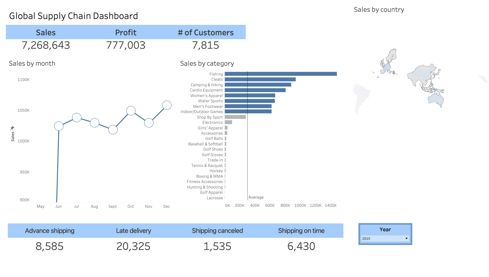

# Global Supply Chain Dashboard

> **An analytic dashboard built from the [DataCo Smart Supply Chain](https://www.kaggle.com/datasets/shashwatwork/dataco-smart-supply-chain-for-big-data-analysis) dataset.**


<div align="center">
  
</div>


[**Public link**](https://public.tableau.com/app/profile/arsen.pankiv/viz/KPIs_Project_v2/Dashboard1?publish=yes) · [**Download Dashboard File**](KPI's_Project_v2.twb) · [**Dataset**](https://www.kaggle.com/datasets/shashwatwork/dataco-smart-supply-chain-for-big-data-analysis)


---

## Table of Contents

* [Overview](#overview)
* [Dataset](#dataset)
* [KPIs & Definitions](#kpis--definitions)
* [Dashboard Features](#dashboard-features)
* [Highlights & Insights](#highlights--insights)
* [How to Use](#how-to-use)
* [Project Structure](#project-structure)
* [Reproducibility Notes](#reproducibility-notes)
* [Attribution](#attribution)
* [Contact](#contact)

---

## Overview

This project presents a **Global Supply Chain Dashboard** that surfaces end‑to‑end performance across sales, profitability, customer activity, categories, geographies, and shipping reliability. The focus is clarity and decision‑readiness: a concise KPI header, time‑series trend, category breakdowns, geographic view, and shipping SLAs.

The dashboard is designed to answer:

* *How are sales and profit trending over time?*
* *Which product categories and regions drive performance?*
* *Are we meeting on‑time shipping targets? Where are delays and cancellations concentrated?*

> **Tooling**: Built in **Tableau**

---

## Dataset

* **Name**: DataCo Smart Supply Chain for Big Data Analysis
* **Source**: Kaggle – [https://www.kaggle.com/datasets/shashwatwork/dataco-smart-supply-chain-for-big-data-analysis](https://www.kaggle.com/datasets/shashwatwork/dataco-smart-supply-chain-for-big-data-analysis)
* **Scope**: Transaction‑level orders with product, customer, geography, shipping method/timing, and profitability fields.
* **Files used**: `DataCoSupplyChainDataset.csv` 

---

## KPIs & Definitions

* **Sales** — Sum of order revenue.
* **Profit** — Sum of profit per order.
* **# of Customers** — Count of unique customers.
* **Shipping SLA** — Counts of *Advance shipping*, *Late delivery*, *Shipping canceled*, *Shipping on time* based on scheduled vs. actual delivery dates.


---

## Dashboard Features

* **KPI header** with Sales, Profit, and Customers.
* **Sales by Month** line chart with markers to rapidly spot seasonality or dips.
* **Sales by Category** horizontal bars with an average reference line for quick benchmarking.
* **Sales by Country** map for geographic distribution.
* **Shipping Reliability** tiles: advance, late, canceled, and on‑time shipments.
* **Year filter** (slider) to slice the entire view by time.

---

## Highlights & Insights

* **Top category**: Fishing leads all categories, materially above the portfolio average. Cleats and Camping & Hiking follow as strong contributors, while categories like Lacrosse and Accessories remain minimal.

* **Seasonality**: Sales remain steady around **$1M/month**, with a noticeable uptick in October–December, indicating stronger year-end demand.

* **Shipping performance**: On-time shipments **(6,430)** significantly outnumber cancellations **(1,535)**; however, late deliveries **(20,325)** exceed advance shipments **(8,585)**, highlighting a key improvement opportunity.

* **Geographic coverage**: Sales are concentrated in selected **European** and **Asia-Pacific** countries, while other regions show lighter intensity, presenting opportunities for expansion or targeted promotions.

---

## How to Use

### Tableau (recommended)

1. Open `KPI's_Project_v2.twb` in **Tableau Desktop**.
2. Connect the workbook to `dataset/DataCoSupplyChainDataset.csv` (or your local path).
3. Ensure date fields are recognized (`order date (DateOrders)`); set locale if needed.
4. **Publish to Tableau Public** (optional) for an interactive link.

---

## Project Structure

```
├─ screenshots/
│  ├─ image_1.png            # Screenshot for README
│  
├─ dataset/
│  └─ DataCoSupplyChainDataset.csv           # Dataset
├─ KPI's_Project_v2.twb      # Tableau packaged workbook
│  
└─ README.md
```

---

## Reproducibility Notes

* **Data cleaning**: Minimal. Used dataset as provided — only verified data types (dates, numeric fields).
* **Derived fields**: None created; all fields (Sales, Profit Per Order
, Customer ID, Shipping status) came directly from the dataset.
* **KPI formulas**:

  * **Sales** = Sum of order revenue
  * **Profit** = Sum of profit per order
  * **# of Customers** = Count of unique customers
  * **Shipping SLA** = Counts of Advance, Late, Canceled, and On‑time deliveries based on scheduled vs. actual delivery dates


---

## Attribution

Dataset by **Shashwat Tiwari**  – [**DataCo Smart Supply Chain for Big Data Analysis**](https://www.kaggle.com/datasets/shashwatwork/dataco-smart-supply-chain-for-big-data-analysis)

---

## Contact

* **Author**: *Arsen Pankiv*
* **LinkedIn**: *[LinkedIn](https://www.linkedin.com/in/arsen-pankiv-6082b4349/)*
* **GitHub**: *[GitHub](https://github.com/Arsen-Pankiv)*
* **Email**: *[ya.dezgun@gmail.com](mailto:ya.dezgun@gmail.com)*


